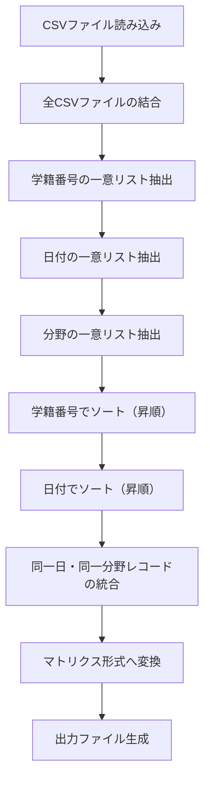

# 学習記録データ統合仕様書

## 1. 概要

本仕様書は、学習記録CSVファイルを統合し、学籍番号順・日付順に整理したマトリクス形式のデータを生成するための仕様を定義する。

---

## 2. 入力データ形式

### 2.1 CSVファイル構造

| カラム名 | 型 | 説明 |
|---------|------|------|
| 学籍番号 | 文字列 | 学生ID（例：P23001） |
| 氏名 | 文字列 | 学生氏名 |
| 日付 | 日付 | 記録日（例：2026/2/3） |
| 時刻 | 時刻 | 記録時刻（例：12:21） |
| 分野 | 文字列 | 学習分野名（例：解剖学：骨関節・筋） |
| 問題数 | 整数 | 解いた問題数 |
| 正答数 | 整数 | 正解した問題数 |
| 正答率(%) | 整数 | 正答率（パーセント） |

### 2.2 入力ファイル命名規則

- 形式：`学習記録_フィルター済み_YYYY-MM-DD.csv`
- 例：`学習記録_フィルター済み_2026-02-03.csv`

---

## 3. 出力データ形式

### 3.1 マトリクス構造

統合後のデータは、以下のマトリクス形式で出力する：

```
         | 2026/2/2                    | 2026/2/3                    | ...
         | 分野A      | 分野B          | 分野A      | 分野B          |
学籍番号  | 問|正|率   | 問|正|率       | 問|正|率   | 問|正|率       |
---------|-----------|---------------|-----------|---------------|
P21091   | 55|19|35   | 7|2|29        | ...       | ...           |
P22002   | 54|20|37   | -|-|-         | ...       | ...           |
...
```

### 3.2 ソート規則

1. **行（縦軸）**: 学籍番号の昇順
   - P21xxx → P22xxx → P23xxx の順
   
2. **列（横軸）**: 日付の昇順
   - 古い日付 → 新しい日付
   - 同一日付内では分野名の五十音順（または出現順）

### 3.3 出力カラム詳細

各日付・分野ごとに以下の3カラムを出力：

| サブカラム | 説明 |
|-----------|------|
| 問 | 問題数の合計 |
| 正 | 正答数の合計 |
| 率 | 統合後正答率（%） |

---

## 4. データ統合ルール

### 4.1 同一日・同一分野の統合

同じ学籍番号が、同じ日に同じ分野で複数回学習した場合：

| 項目 | 統合方法 |
|------|----------|
| 問題数 | 合計（SUM） |
| 正答数 | 合計（SUM） |
| 正答率 | 再計算: `(正答数合計 / 問題数合計) × 100` |

#### 例：P23112 の 2026/2/3 解剖学：骨関節・筋

| 記録 | 問題数 | 正答数 | 正答率 |
|------|--------|--------|--------|
| 1回目 | 28 | 13 | 46% |
| 2回目 | 25 | 18 | 72% |
| 3回目 | 25 | 22 | 88% |
| 4回目 | 28 | 26 | 93% |
| **統合後** | **106** | **79** | **74.5%** |

### 4.2 欠損値の扱い

該当日・該当分野にデータがない場合は `-` または空欄を表示する。

---

## 5. 処理フロー



---

## 6. 分野名一覧（現時点）

現在確認されている分野：

| No | 分野名 |
|----|--------|
| 1 | 解剖学：骨関節・筋 |

> [!NOTE]
> 新しい分野が追加された場合、自動的に列が追加される仕様とする。

---

## 7. 出力ファイル形式

### 7.1 ファイル命名規則

- 形式：`学習記録_統合_YYYY-MM-DD.csv` または `学習記録_統合_YYYY-MM-DD.xlsx`
- 日付は統合処理実行日

### 7.2 出力例

#### CSVフォーマット（フラット形式）

```csv
学籍番号,氏名,日付,分野,問題数,正答数,正答率(%)
P21091,平井翔吾,2026/2/2,解剖学：骨関節・筋,55,19,35
P21091,平井翔吾,2026/2/3,解剖学：骨関節・筋,27,9,33
P22002,赤堀悠翔,2026/2/2,解剖学：骨関節・筋,54,20,37
P22002,赤堀悠翔,2026/2/3,解剖学：骨関節・筋,24,11,46
...
```

#### Excelフォーマット（マトリクス形式）

シート構成：
- **シート1「サマリー」**: 日付×分野のマトリクス表示
- **シート2「詳細データ」**: フラット形式の全統合データ

---

## 8. 今後の拡張予定

| 項目 | 説明 |
|------|------|
| CSVファイル追加 | 日次で新しいCSVファイルを追加し、累積データを管理 |
| 複数分野対応 | 新しい分野が追加された場合、自動で列を拡張 |
| 期間指定フィルタ | 特定期間のみ抽出する機能 |
| 学籍番号フィルタ | 特定の学籍番号のみ抽出する機能 |

---

## 9. バージョン履歴

| バージョン | 日付 | 変更内容 |
|-----------|------|----------|
| 1.0 | 2026-02-03 | 初版作成 |
